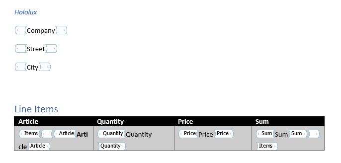

# Azure Function - Word Generator 

This Azure Function replaces content placeholder in a Word document. It also support repeating elments. With help of the swagger file you can easly use this Function as a custom connector in Microsoft Flow.

The endpoint /api/ProccessTemplate accepts the following JSON body

```JSON
{
    "document":"{word file as base64 encoded string}",
    "data": {
        "Company":"Hololux",
        "Street":"Europaallee 27d",
        "City":"Saarbruecken",
        "Items":[
            {
                "Article":"4711",
                "Quantity":"2",
                "Price":"5",
                "Sum":"10"
            },
            {
                "Article":"4712",
                "Quantity":"1",
                "Price":8,
                "Sum":8
            }
        ]
    }
}
```

The function returns the word document as base64 string.

The corresponding example word template looks like this:


[Example word file](./tests/test.docx)
